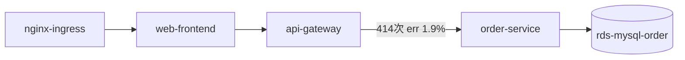

# Skill: 服务拓扑梳理

## 目标
从 Trace 数据聚合出服务调用拓扑（节点 + 有向边 + 流量统计），识别病灶边。

## 方法
1. 调用 `build_topology` 工具：它对所有 kind=client 的 span 按 (service, peer.service) 分组，统计 call_count、error_rate、avg/p99 时延，落库 topology_edges。
2. 边的类型判读：
   - 服务间调用：target 是集群内 Deployment（如 frontend → api-gateway）
   - 数据库调用：client span 带 db.system 属性，peer.service 是实例 ID（如 order-service → rds-mysql-01 是 MySQL，payment-service → kvstore-redis-01 是 Redis）
3. 病灶识别：重点报告 error_rate 明显高于其他边（如 >1%）或 p99 明显偏高的边，并给出该边上下游服务。

## 输出要求
- 汇报节点数、边数、总调用量；
- **必须附一个 ```mermaid 代码块（flowchart LR 格式）画出拓扑图**，前端会自动渲染成图形：
  节点用服务名，数据库用圆柱体 [(名字)]，异常边（错误率>1%）在边标签里标注错误率；
  注意 mermaid 节点 id 不能含连字符以外的特殊字符，服务名作为显示标签；
- 逐条列出边（source → target: 调用数/错误率/P99），可用表格；
- 单独点名异常边并建议下一步（如"order-service → rds-mysql-order 错误率 1.9%，建议做故障定位"）。

mermaid 示例骨架：



## 注意
- GET /api/products 由 frontend 本地缓存直接返回，不下探 api-gateway，拓扑上 frontend 出边流量小于入边是正常现象；
- 不要虚构不存在的边；一切以 build_topology 返回为准。
