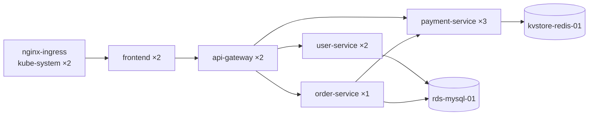
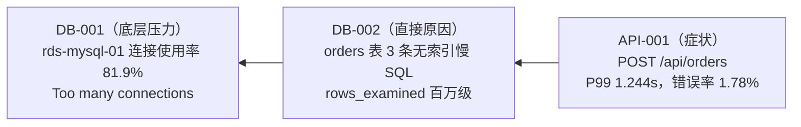

#  Mock 数据说明（自洽微型世界）

本文档说明 `mock/generate_world.py` 生成的"自洽微型世界" Mock 数据集（`mock/output/world/` 下 8 个文件），配套《智能运维Agent设计文档》使用。面向两类读者：

- **演示评委**：想从任意入口（指标/日志/事件/链路/K8s 资源）查进来，验证数据互相印证、不穿帮；
- **后续开发者**：要把这套数据接进 MockProvider，需要知道每个文件的格式契约与消费注意点。

通用格式细节（CMS `DescribeMetricList` 响应结构、Trace span schema）已在《CMS_Mock数据说明.md》《SLS_链路数据梳理指南.md》讲透，本文不重复，只讲本数据集特有的内容并交叉引用。

---

## 1. 概述

**"自洽微型世界"** 是指：先在 `mock/world.py` 里定义一个唯一事实源（Single Source of Truth）——集群、节点、服务、Pod、数据库、接口、调用拓扑、慢 SQL、错误文案、11 条风险清单——再由 4 个生成器把同一份世界观分别"渲染"成 K8s 资源快照、CMS 指标、SLS 日志、Trace 链路。因为所有产物都源自同一份常量，所以拓扑、指标、日志、事件、K8s 资源**互相印证**：同一个 Pod 在快照里的 IP、在日志里的来源 IP、在 Trace 里的 peer 地址逐字一致；Ingress 日志的 `req_id` 就是 Trace 的 `traceID`；慢 SQL 文本在慢日志、Trace `db.statement`、应用日志 WARN 三处逐字相同。评委从任何一个入口查进来，交叉验证都不穿帮。

**与 v1 数据集的关系**：`mock/output/` 根目录下的旧产物（`mock_cms_k8s_data.json`、`anomaly_manifest.json`、`mock_sls_trace_spans.jsonl`、`mock_sls_topology_ground_truth.json`、`mock_cms_trace_entities_data.json`、`trace_to_cms_mapping.json`、`trace_manifest.json`）是 v1 数据集，由 `mock/cms_mock_generator.py` / `mock/trace_mock_generator.py` 生成，描述的是另一个旧世界（cn-beijing、15 个服务、PostgreSQL）。**两套数据集并存、互不引用**：本数据集全部落在 `mock/output/world/` 子目录，世界观（cn-hangzhou、6 服务、MySQL + Redis）与 v1 完全独立，文件名亦无重叠，任意顺序生成互不影响。

---

## 2. 世界观全景

### 2.1 集群与节点

| 项 | 值 |
|----|-----|
| 集群名 | `prod-cluster-01` |
| K8s 版本 | `1.28`（kubelet `v1.28.9-aliyun.1`） |
| 地域 | `cn-hangzhou` |
| 阿里云主账号 ID | `1208863178610000`（虚构） |
| 节点数 | 6 台，均匀分布在 3 个可用区（每区 2 台） |

6 节点全部为同规格 `ecs.g6.xlarge`（capacity 4C/8Gi，allocatable 3900m/7680Mi，扣除 kubelet/系统预留）：

| 节点 | 可用区 | 内网 IP | capacity | allocatable |
|------|--------|---------|----------|-------------|
| node-01 | cn-hangzhou-h | 192.168.0.11 | 4000m / 8192Mi | 3900m / 7680Mi |
| node-02 | cn-hangzhou-h | 192.168.0.12 | 4000m / 8192Mi | 3900m / 7680Mi |
| node-03 | cn-hangzhou-i | 192.168.0.13 | 4000m / 8192Mi | 3900m / 7680Mi |
| node-04 | cn-hangzhou-i | 192.168.0.14 | 4000m / 8192Mi | 3900m / 7680Mi |
| node-05 | cn-hangzhou-j | 192.168.0.15 | 4000m / 8192Mi | 3900m / 7680Mi |
| node-06 | cn-hangzhou-j | 192.168.0.16 | 4000m / 8192Mi | 3900m / 7680Mi |

### 2.2 服务部署（6 个 Deployment，共 12 个 Pod）

| 服务 | 命名空间 | 副本 | 版本 | Pod 落点（节点） | requests | limits | 探针 | PDB | 预埋缺陷 |
|------|----------|------|------|------------------|----------|--------|------|-----|----------|
| payment-service | default | 3 | v2.3.1 | node-01×2, node-02（全在 h 区，nodeAffinity 钉死） | 500m / 512Mi | 4000m / **无 memory** | 有 | 有 | HA-001, CAP-002 |
| order-service | default | **1** | v1.8.4 | node-03 | 500m / 512Mi | 4000m / 2048Mi | 有 | 有 | HA-002 |
| user-service | default | 2 | v3.1.0 | node-03, node-05 | 250m / 512Mi | 4000m / 2048Mi | **无** | 有 | HA-003 |
| api-gateway | default | 2 | v2.0.7 | node-04, node-06 | **无 cpu** / 512Mi | 4000m / 2048Mi | 有 | 有 | CAP-001 |
| frontend | default | 2 | v4.2.5 | node-05, node-01 | 250m / 256Mi | 3650m / 1024Mi | 有 | **无** | HA-004 |
| nginx-ingress | kube-system | 2 | v1.9.6 | node-02, node-04 | 500m / 512Mi | 1000m / 1024Mi | 有 | 有 | 无（健康参照组） |

表中"**无 xxx**"表示该键在 K8s spec 中**缺失**（不是值为 0），这是 6 项配置类风险的证据本体。Pod 名（如 `payment-service-7f9c6bd8d-x2k4q`）与 Pod IP（`10.244.<节点序号>.<分配序号>` 网段）在 `world.py` 中写死，保证跨文件一致。

### 2.3 数据库实例

| 实例 ID | 类型 | 版本 | 连接地址 | 上游服务 | 指标基线（常态） |
|---------|------|------|----------|----------|------------------|
| rds-mysql-01 | RDS MySQL | 8.0 | `rm-bp1a2b3c4d5e6f7.mysql.rds.aliyuncs.com:3306`（库 `appdb`） | user-service, order-service | **ConnectionUsage=82%**、**MemoryUsage=87%**、CpuUsage=45%、DiskUsage=38%、IOPSUsage=22% |
| kvstore-redis-01 | Redis（KVStore） | 7.0 | `r-bp1x2y3z4a5b6c.redis.rds.aliyuncs.com:6379` | payment-service | CpuUsage=18%、MemoryUsage=42%、ConnectionUsage=15%（健康参照组） |

### 2.4 接口基线（8 个接口，期望 vs 实测）

期望值来自 `world.APIS`（世界观设定），实测值由编排脚本从 Ingress 日志独立复算后写入 `world_manifest.json` 的 `api_baseline`：

| 接口 | 后端服务 | QPS | 期望错误率 | 实测错误率 | 期望 P99 | 实测 P99 |
|------|----------|-----|-----------|-----------|----------|----------|
| GET /api/users | user-service | 1.5 | 0.2% | 0.18% | 180ms | 175.0ms |
| POST /api/users/login | user-service | 0.6 | 0.5% | 0.47% | 250ms | 291.0ms |
| GET /api/orders | order-service | 1.0 | 0.4% | 0.39% | 300ms | 300.0ms |
| **POST /api/orders** | order-service | 1.0 | **1.8%** | **1.78%** | **1200ms** | **1244.0ms** |
| POST /api/orders/cancel | order-service | 0.3 | 0.5% | 0.53% | 350ms | 349.0ms |
| POST /api/pay | payment-service | 0.5 | 0.6% | 0.57% | 400ms | 390.0ms |
| GET /api/pay/status | payment-service | 0.5 | 0.3% | 0.34% | 150ms | 158.0ms |
| GET /api/products | frontend | 1.2 | 0.1% | 0.09% | 80ms | 84.0ms |

加粗的 `POST /api/orders` 是唯一的病灶接口（API-001），其余 7 个是健康基线。

### 2.5 服务拓扑（9 条有向边）



`world_manifest.json` 的 `topology_ground_truth` 给出这 9 条边从 Trace 数据真实聚合出的流量统计（如 `nginx-ingress → frontend` 1216 次调用、`order-service → rds-mysql-01` 错误率 1.93%），是拓扑梳理练习的标准答案（梳理算法见《SLS_链路数据梳理指南.md》第 2 节）。注意 `GET /api/products` 由 frontend 本地缓存直接返回，不下探 api-gateway。

---

## 3. 产物文件清单与格式说明

8 个文件全部位于 `mock/output/world/`（行数/大小与 `world_manifest.json` 的 `meta.files` 一致）：

| 文件 | 行数 | 条目数 | 大小 | 用途 |
|------|------|--------|------|------|
| k8s_resources.json | 2,146 | 35 | 62,197 B | K8s 资源快照（6 节点 + 6 Deployment + 12 Pod + 6 Service + 5 PDB） |
| cms_metrics.json | 178 | 16 | 778,404 B | CMS 指标（16 个 DescribeMetricList 响应，3,904 个数据点） |
| sls_ingress_logs.jsonl | 11,939 | 11,939 | 8,492,595 B | Nginx Ingress 访问日志（30 分钟全量请求） |
| sls_k8s_events.jsonl | 40 | 40 | 21,386 B | K8s 事件（Deployment 发布过程，背景音） |
| sls_app_logs.jsonl | 395 | 395 | 88,464 B | 应用日志（348 INFO / 17 WARN / 30 ERROR） |
| sls_rds_slowlog.jsonl | 50 | 50 | 21,360 B | RDS MySQL 慢日志 |
| sls_trace_spans.jsonl | 9,246 | 9,246 | 9,158,193 B | Trace 链路 span（1,216 条 trace） |
| world_manifest.json | 417 | — | 13,584 B | 标准答案清单（风险/拓扑/接口基线/文件校验和） |

**时间窗约定**（本数据集实际值，见 manifest `meta`）：`end_ts_ms = 1785757800000`（2026-08-03 19:50 +0800）；CMS 回看 60 分钟（`1785754200000 ~ 1785757800000`）；日志/Trace 回看 30 分钟（秒级 `1785756000 ~ 1785757800`，即 19:20~19:50 +0800）。

### 3.1 k8s_resources.json

单个 JSON 对象，顶层键 `generated_at` / `cluster` / `nodes` / `deployments` / `pods` / `services` / `poddisruptionbudgets`，后 5 个均为 `kubectl get xxx -o json` 风格的 `List`。节点真实样例（截取）：

```json
{
  "apiVersion": "v1", "kind": "Node",
  "metadata": {
    "name": "node-01",
    "labels": {
      "topology.kubernetes.io/region": "cn-hangzhou",
      "topology.kubernetes.io/zone": "cn-hangzhou-h",
      "node.kubernetes.io/instance-type": "ecs.g6.xlarge"
    }
  },
  "status": {
    "capacity": {"cpu": "4", "memory": "8Gi", "pods": "64"},
    "allocatable": {"cpu": "3900m", "memory": "7680Mi", "pods": "64"}
  }
}
```

消费注意点：

- CPU 有两种写法：`"4"`（核）与 `"3900m"`（毫核），解析时需统一换算（编排脚本用 `parse_cpu_m`）；
- 配置缺陷表现为**键缺失**：如 api-gateway 容器的 `resources.requests` 只有 `{"memory": "512Mi"}`，判断时用 `"cpu" not in requests`，不能用 `requests["cpu"] == 0`；
- Pod 的 `status.podIP` / `spec.nodeName` 是跨文件 join 的锚点（对应日志 `pod_ip`、Trace `k8s.pod.ip`）。

### 3.2 cms_metrics.json

JSON 数组，16 个 `DescribeMetricList` 风格响应。**响应结构与《CMS_Mock数据说明.md》第 1~2 节完全一致**——尤其是 `Datapoints` 是 **JSON 字符串**、必须 `json.loads()` 二次解析这个坑，此处不再重复。本数据集特有的指标清单：

| Namespace | MetricName | 数据点数 | 维度 |
|-----------|-----------|---------|------|
| acs_k8s | pod.cpu.utilization / pod.memory.utilization / pod.restart_count | 各 732（12 Pod × 61 分钟） | userId, cluster, namespace, pod |
| acs_k8s | node.cpu.utilization / node.memory.utilization / node.disk.utilization | 各 366（6 节点 × 61） | userId, cluster, node |
| acs_k8s | cluster.pod.count | 61 | userId, cluster（Sum） |
| acs_k8s | **namespace.cpu.oversale_rate** | 61 | userId, cluster, namespace |
| acs_rds_dashboard | ConnectionUsage / MemoryUsage / CpuUsage / DiskUsage / IOPSUsage | 各 61 | userId, instanceId |
| acs_kvstore | CpuUsage / MemoryUsage / ConnectionUsage | 各 61 | userId, instanceId |

数据点真实样例（`namespace.cpu.oversale_rate` 与 RDS `ConnectionUsage` 各一）：

```json
{"timestamp": 1785754200000, "userId": "1208863178610000", "cluster": "prod-cluster-01",
 "namespace": "default", "Average": 168.6, "Maximum": 169.56, "Minimum": 167.73}
{"timestamp": 1785754200000, "userId": "1208863178610000", "instanceId": "rds-mysql-01",
 "Average": 82.46, "Maximum": 83.32, "Minimum": 81.61}
```

消费注意点：数据库指标用 `instanceId` 维度（不是 pod/node）；`namespace.cpu.oversale_rate` 是 Mock 扩展指标（见第 9 节差异声明）。

### 3.3 sls_ingress_logs.jsonl

JSONL（每行一个 JSON 对象），字段对齐阿里云 SLS 采集的 Nginx Ingress 访问日志。真实样例（UA 截断）：

```json
{"__time__": "1785756000", "__topic__": "nginx-ingress", "__source__": "nginx-ingress-8b7a6f5e4-y7z9a",
 "client_ip": "60.180.204.169", "remote_user": "-", "time_local": "03/Aug/2026:19:20:00 +0800",
 "method": "GET", "url": "/api/pay/status", "version": "HTTP/1.1", "status": "200",
 "body_bytes_sent": "2335", "http_referer": "https://www.google.com/",
 "http_user_agent": "Mozilla/5.0 (Linux; Android 14; Pixel 8) ...",
 "request_length": "832", "request_time": "0.038", "proxy_upstream_name": "default-frontend-80",
 "upstream_addr": "10.244.5.11:80", "upstream_response_time": "0.035", "upstream_status": "200",
 "req_id": "aefc6f918329731992c4ae3517e9032a", "host": "shop.example.com"}
```

消费注意点：

- **所有值都是字符串**（SLS 采集风格）：`__time__` 是**秒级**时间戳字符串，`status`、`request_time` 也是字符串，做数值比较前要 `int()` / `float()`；
- `req_id` 是与 Trace 的 join 键：被采样的请求在 `sls_trace_spans.jsonl` 中存在**同值** `traceID`；
- `upstream_addr` 的 IP 必属 frontend Pod IP 集合（`10.244.5.11` / `10.244.1.12`，Ingress 只直连 frontend）；
- `__source__` 是采集来源的 nginx-ingress Pod 名，与 K8s 快照逐字一致。

### 3.4 sls_k8s_events.jsonl

40 条 K8s 事件，全部为 `Normal` 类型（`ScalingReplicaSet` → `SuccessfulCreate` → `Scheduled` → `Pulling` → `Pulled` → `Started`），模拟 6 个 Deployment 在窗口起始的发布过程。真实样例：

```json
{"__time__": "1785756011", "__topic__": "k8s-events", "__source__": "default/payment-service",
 "event_type": "Normal", "reason": "ScalingReplicaSet",
 "message": "Scaled up replica set payment-service-7f9c6bd8d to 3", "pod_name": "",
 "namespace": "default", "cluster": "prod-cluster-01", "involved_object_kind": "Deployment",
 "involved_object_name": "payment-service", "count": "1", "first_timestamp": "1785756011",
 "last_timestamp": "1785756011", "reporting_controller": "deployment-controller"}
```

消费注意点：事件是"背景音"，**不含任何 Warning**——本世界的 11 条风险全部是配置/水位/性能类，没有崩溃事故；如果诊断 Agent 从事件里报出故障，就是幻觉。事件中的 Pod 名（如 `Created pod: payment-service-7f9c6bd8d-t5r7c`）与快照逐字一致。

### 3.5 sls_app_logs.jsonl

395 条应用日志（348 INFO / 17 WARN / 30 ERROR）。三个级别的真实样例：

```json
{"__time__": "1785756000", "__topic__": "app-log", "__source__": "user-service-6c7d8e9f5-c3d4e",
 "level": "INFO", "pod_ip": "10.244.3.11", "message": "request completed path=/api/users status=200 latency=0.048s"}
{"__time__": "1785756049", "__topic__": "app-log", "__source__": "order-service-5d8b9c7f6-a1b2c",
 "level": "WARN", "pod_ip": "10.244.3.10", "message": "slow query detected (1.7s): SELECT * FROM orders WHERE user_id = 8231 AND status = 'PENDING' ORDER BY created_at DESC"}
{"__time__": "1785756141", "__topic__": "app-log", "__source__": "order-service-5d8b9c7f6-a1b2c",
 "level": "ERROR", "pod_ip": "10.244.3.10", "message": "failed to create order: could not get JDBC connection: Too many connections (host=rm-bp1a2b3c4d5e6f7.mysql.rds.aliyuncs.com:3306, db=appdb)"}
```

消费注意点：WARN 里的慢 SQL 文本、ERROR 里的 `Too many connections` / `SQLTimeoutException: Statement cancelled due to timeout` 均与 `world.ERROR_TEXTS` / `world.SLOW_SQLS` **逐字一致**（全文检索可跨产物印证）；30 条 ERROR 中两类文案各 15 条，全部来自 order-service 唯一的 Pod。

### 3.6 sls_rds_slowlog.jsonl

50 条慢日志，SQL 文本只有 3 种（`world.SLOW_SQLS` 循环出现）。真实样例：

```json
{"__time__": "1785756013", "__topic__": "rds_slow_log", "__source__": "rds-mysql-01",
 "instance_id": "rds-mysql-01", "db_name": "appdb",
 "sql_text": "SELECT * FROM orders WHERE user_id = 8231 AND status = 'PENDING' ORDER BY created_at DESC",
 "query_time": "1.589", "lock_time": "0.00039", "rows_examined": "1252771", "rows_sent": "7",
 "user_host": "app_user[app_user] @ [10.244.3.10]", "start_time": "2026-08-03 19:20:13"}
```

消费注意点：`rows_examined` 百万级、`rows_sent` 个位数是"无索引全表扫描"的教科书特征；`user_host` 里的来源 IP `10.244.3.10` 就是 order-service Pod 的 IP（与快照/应用日志三方印证）。

### 3.7 sls_trace_spans.jsonl

9,246 个 span、1,216 条 trace（对 11,939 条 Ingress 请求约 10% 采样）。**span schema 逐字段说明见《SLS_链路数据梳理指南.md》第 1 节**，此处只列关键消费注意点：

- `attribute` / `resource` / `logs` / `links` 是 **JSON 字符串**，需二次 `json.loads()`（与 CMS `Datapoints` 同款"格式守恒"坑）；
- `start` / `end` / `duration` 为**微秒**（÷1,000,000 得秒），`__time__` 为秒级**整数**（注意与其他 JSONL 的字符串 `__time__` 不同）；
- 根 span 判定：`parentSpanID == ""`；`traceID` 与 Ingress `req_id` 同值；
- 慢查询 span 的 `attribute.db.statement` 是慢 SQL 原文；ERROR span 的 `statusMessage` 是 `world.ERROR_TEXTS` 原文。

真实样例（resource 截断）：

```json
{"traceID": "edfeb0f73a2853152682aa14b7dd72a7", "spanID": "92b0bc9dbf73c91e", "parentSpanID": "",
 "service": "nginx-ingress", "host": "nginx-ingress-8b7a6f5e4-v3w5x", "name": "POST /api/pay",
 "kind": "server", "start": 1785756001792000, "end": 1785756001930900, "duration": 138900,
 "statusCode": "OK", "statusMessage": "",
 "attribute": "{\"http.method\": \"POST\", \"http.url\": \"http://shop.example.com/api/pay\", \"http.status_code\": 200, ...}",
 "resource": "{\"service.name\": \"nginx-ingress\", \"host.name\": \"nginx-ingress-8b7a6f5e4-v3w5x\", \"k8s.pod.ip\": \"10.244.2.11\", ...}",
 "logs": "[]", "links": "[]", "__time__": 1785756001}
```

### 3.8 world_manifest.json

标准答案清单，4 大块：

| 块 | 内容 |
|----|------|
| `meta` | generator_version / seed / end_ts_ms / 时间窗 / 8 个文件的行数、字节数、sha256 |
| `risk_ground_truth` | 11 条风险：`rule_id` / `severity` / `evidence_files`（证据文件列表）/ `how_to_verify`（验证口径）/ `expected`（期望）/ `measured`（生成后从产物**独立实测**的值） |
| `topology_ground_truth` | 8 个拓扑节点 + 9 条边的真实流量统计（call_count / error_rate / 时延） |
| `api_baseline` | 8 接口的期望值与 Ingress 日志实测值 |

消费注意点：`measured` 不是抄设定值，而是编排脚本读产物复算出来的——评委验证时应以 `measured` 为对账基准（本文第 4 节的"预期看到的值"全部取自它）。

---

## 4. 11 个风险点证据地图

总览（severity 与 measured 均取自 `world_manifest.json`）：

| 规则 ID | 严重度 | 标题 | 证据文件 |
|---------|--------|------|----------|
| HA-001 | P1 | payment-service 单可用区部署（3 副本全在 cn-hangzhou-h） | k8s_resources.json |
| HA-002 | P1 | order-service 单副本运行 | k8s_resources.json |
| HA-003 | P2 | user-service 缺失存活/就绪探针 | k8s_resources.json |
| HA-004 | P2 | frontend 缺失 PodDisruptionBudget | k8s_resources.json |
| CAP-001 | P1 | api-gateway 缺失 CPU request | k8s_resources.json |
| CAP-002 | P2 | payment-service 缺失内存 limit | k8s_resources.json |
| CAP-003 | P1 | default 命名空间 CPU 超卖率 168%（阈值 150%） | cms_metrics.json |
| CAP-004 | P2 | rds-mysql-01 内存使用率常态 87% | cms_metrics.json |
| DB-001 | P1 | rds-mysql-01 连接使用率常态 82% | cms_metrics.json + sls_app_logs.jsonl |
| DB-002 | P2 | rds-mysql-01 存在无索引慢查询（orders 表全表扫描） | sls_rds_slowlog.jsonl + sls_trace_spans.jsonl + sls_app_logs.jsonl |
| API-001 | P1 | POST /api/orders P99 达 1.2s 且错误率 1.8% | sls_ingress_logs.jsonl + sls_trace_spans.jsonl + sls_app_logs.jsonl |

以下每条给出可直接复制运行的验证命令（在仓库根目录运行）。命令统一用 `python3 -c "<代码>"` 形式：`python3` 调 Python 3 解释器，`-c` 表示"执行后面字符串里的代码而不是脚本文件"，全部只用标准库 `json`（读文件 + 解析 JSON），只读不写、可放心反复执行。

### 4.1 HA-001：payment-service 单可用区部署

```bash
python3 -c "
import json
d = json.load(open('mock/output/world/k8s_resources.json'))
zone = {n['metadata']['name']: n['metadata']['labels']['topology.kubernetes.io/zone']
        for n in d['nodes']['items']}
pods = [p for p in d['pods']['items'] if p['metadata']['labels']['app'] == 'payment-service']
print(len(pods), sorted({zone[p['spec']['nodeName']] for p in pods}))
"
```

这条命令做什么：第 1 步建"节点名 → 可用区"字典（可用区藏在节点的 `topology.kubernetes.io/zone` 标签里，Pod 自己不带 zone 信息，必须 join 节点）；第 2 步筛出 `app=payment-service` 的 Pod；第 3 步把每个 Pod 的 `spec.nodeName` 翻译成 zone 并用集合去重。**预期输出**：`3 ['cn-hangzhou-h']`——3 个副本、zone 集合只有 1 个元素，即 manifest 所记 "3 Pod 全在 cn-hangzhou-h（zone 数=1）"。根因可进一步在该 Deployment 的 `spec.template.spec.affinity.nodeAffinity` 里看到 `values: ["cn-hangzhou-h"]` 的硬性亲和。

### 4.2 HA-002：order-service 单副本

```bash
python3 -c "
import json
d = json.load(open('mock/output/world/k8s_resources.json'))
dep = [x for x in d['deployments']['items'] if x['metadata']['name'] == 'order-service'][0]
print(dep['spec']['replicas'])
"
```

这条命令做什么：从 `deployments.items` 列表推导式筛出名为 order-service 的那一个（`[0]` 取首个匹配），打印其 `spec.replicas`。**预期输出**：`1`（manifest measured：`spec.replicas=1`）。单副本意味着 Pod 重建期间服务完全不可用。

### 4.3 HA-003：user-service 缺失双探针

```bash
python3 -c "
import json
d = json.load(open('mock/output/world/k8s_resources.json'))
c = [x for x in d['deployments']['items'] if x['metadata']['name'] == 'user-service'
     ][0]['spec']['template']['spec']['containers'][0]
print('livenessProbe' in c, 'readinessProbe' in c)
"
```

这条命令做什么：取 user-service 首个容器的 spec，用 `in` 运算符检查**键是否存在**（缺陷是"键缺失"而非"值为空"，所以不能用 `c.get('livenessProbe') is None` 之外还要确认键根本不在）。**预期输出**：`False False`（manifest measured：`livenessProbe/readinessProbe 键均缺失`）。对照组：其余 5 个服务同一位置两键均为 `True`。

### 4.4 HA-004：frontend 缺失 PDB

```bash
python3 -c "
import json
d = json.load(open('mock/output/world/k8s_resources.json'))
print(sorted(p['spec']['selector']['matchLabels']['app']
             for p in d['poddisruptionbudgets']['items']
             if p['metadata']['namespace'] == 'default'))
"
```

这条命令做什么：遍历 `poddisruptionbudgets.items`，只留 default 命名空间的，取每个 PDB 的 selector 命中的 `app` 标签值，排序打印。**预期输出**：`['api-gateway', 'order-service', 'payment-service', 'user-service']`——default 命名空间 4 个 PDB，**没有 frontend**（第 5 个 PDB 属于 kube-system 的 nginx-ingress）。与 manifest measured 逐字一致。

### 4.5 CAP-001：api-gateway 缺失 CPU request

```bash
python3 -c "
import json
d = json.load(open('mock/output/world/k8s_resources.json'))
res = [x for x in d['deployments']['items'] if x['metadata']['name'] == 'api-gateway'
       ][0]['spec']['template']['spec']['containers'][0]['resources']
print(sorted(res['requests']), sorted(res['limits']))
"
```

这条命令做什么：取 api-gateway 容器的 `resources` 字典，`sorted(dict)` 对字典排序会得到**键名列表**——正好用来看哪些键存在。**预期输出**：`['memory'] ['cpu', 'memory']`——requests 只有 memory 没有 cpu（manifest measured：`requests 键=['memory']（无 cpu）`），limits 完整（说明缺的只是 request）。没有 CPU request，调度器无法为其预留算力。

### 4.6 CAP-002：payment-service 缺失内存 limit

```bash
python3 -c "
import json
d = json.load(open('mock/output/world/k8s_resources.json'))
res = [x for x in d['deployments']['items'] if x['metadata']['name'] == 'payment-service'
       ][0]['spec']['template']['spec']['containers'][0]['resources']
print(sorted(res['requests']), sorted(res['limits']))
"
```

与 4.5 同构，只是换了服务名，看点从 requests 换到 limits。**预期输出**：`['cpu', 'memory'] ['cpu']`——limits 只有 cpu 没有 memory（manifest measured：`limits 键=['cpu']（无 memory）`）。无内存 limit 的容器内存失控时会拖垮所在节点（而且 payment 3 副本里有 2 个挤在 node-01 上）。

### 4.7 CAP-003：default 命名空间 CPU 超卖率 168%

```bash
python3 -c "
import json
cms = json.load(open('mock/output/world/cms_metrics.json'))
pts = [dp['Average'] for r in cms if r['MetricName'] == 'namespace.cpu.oversale_rate'
       for dp in json.loads(r['Datapoints'])]
print(len(pts), round(sum(pts) / len(pts), 2))
"
```

这条命令做什么：在 16 个 CMS 响应中筛出 `namespace.cpu.oversale_rate`，对其 `Datapoints` 字符串做 `json.loads` 二次解析（关键坑，见《CMS_Mock数据说明.md》第 1 节），收集全部数据点的 `Average` 求均值。**预期输出**：`61 167.94`——61 个数据点、均值 167.94% > 阈值 150%（manifest measured：`namespace.cpu.oversale_rate 均值=167.94%`）。算式对账：Σ(default ns Pod cpu limit) ÷ Σ(节点 allocatable cpu) = 39300m ÷ 23400m ≈ 167.95%（世界观设定值），CMS 曲线在其上加了微小波动，均值 167.94% 与之误差 <2pp（编排校验 ④ 强制保证）。

### 4.8 CAP-004：rds-mysql-01 内存使用率常态 87%

```bash
python3 -c "
import json
cms = json.load(open('mock/output/world/cms_metrics.json'))
pts = [dp['Average'] for r in cms
       if r['Namespace'] == 'acs_rds_dashboard' and r['MetricName'] == 'MemoryUsage'
       for dp in json.loads(r['Datapoints'])]
print(round(sum(pts) / len(pts), 2), round(min(pts), 2))
"
```

这条命令做什么：同 4.7 的求均值套路，但**必须同时限定 `Namespace == 'acs_rds_dashboard'`**——因为 Redis（acs_kvstore）也有同名 `MemoryUsage` 指标，不加限定会把 42% 的 Redis 数据混进来拉低均值。额外打印 `min(pts)` 验证"全窗口 > 85%"。**预期输出**：`86.97 85.53`——均值 86.97% > 85%（manifest measured：`MemoryUsage 均值=86.97%`），最小值也在 85% 以上，说明是**常态高水位**而非瞬时毛刺。

### 4.9 DB-001：rds-mysql-01 连接使用率常态 82%

```bash
python3 -c "
import json
cms = json.load(open('mock/output/world/cms_metrics.json'))
pts = [dp['Average'] for r in cms
       if r['Namespace'] == 'acs_rds_dashboard' and r['MetricName'] == 'ConnectionUsage'
       for dp in json.loads(r['Datapoints'])]
print(round(sum(pts) / len(pts), 2))
rows = [json.loads(l) for l in open('mock/output/world/sls_app_logs.jsonl')]
print(sum('Too many connections' in r['message'] for r in rows))
"
```

这条命令做什么：前半段与 4.8 同构，测 `ConnectionUsage` 均值；后半段逐行读应用日志（JSONL 每行独立 `json.loads`），统计 message 含 `Too many connections` 的条数——DB-001 的证据是**指标 + 日志双源印证**。**预期输出**：`81.9` 与 `15`——连接使用率均值 81.9% > 80%（manifest measured：`ConnectionUsage 均值=81.9%`），且应用日志有 15 条获取连接失败的 ERROR。连接池常态 82%，一次流量尖峰就会打满。

### 4.10 DB-002：无索引慢查询（orders 表全表扫描）

```bash
python3 -c "
import json
rows = [json.loads(l) for l in open('mock/output/world/sls_rds_slowlog.jsonl')]
print(len(rows),
      min(int(r['rows_examined']) for r in rows),
      max(int(r['rows_sent']) for r in rows),
      len({r['sql_text'] for r in rows}))
"
```

这条命令做什么：读全部慢日志行，打印 4 个数：总行数、`rows_examined` 最小值（注意字段是字符串，先 `int()`）、`rows_sent` 最大值、去重后的 SQL 文本种数。**预期输出**：`50 1162951 7 3`——50 行慢日志，扫描行数最小也有 1,162,951（均 ≥ 100 万，manifest measured：`rows_examined 最小值=1162951`），返回行数最多 7（区分度 rows_sent/rows_examined ≈ 0，全表扫描铁证），SQL 只有 3 种且都打在 orders 表的 `status`/`created_at` 组合条件上——治理建议：建 `orders(status, created_at)` 复合索引。

### 4.11 API-001：POST /api/orders P99 1.2s、错误率 1.8%

```bash
python3 -c "
import json, math
rows = [json.loads(l) for l in open('mock/output/world/sls_ingress_logs.jsonl')]
rows = [r for r in rows if r['method'] == 'POST' and r['url'] == '/api/orders']
ts = sorted(float(r['request_time']) for r in rows)
p99 = ts[math.ceil(0.99 * len(ts)) - 1]
err = sum(r['status'] in ('500', '502', '504') for r in rows) / len(rows)
print(len(rows), 'P99=%.3fs' % p99, '错误率=%.2f%%' % (err * 100))
"
```

这条命令做什么：筛出 `POST /api/orders` 的全部 Ingress 日志行；把 `request_time`（字符串秒）转 float 升序排列，按"第 `ceil(0.99×n)` 个"取 P99（与设计文档/编排校验同一分位数口径，`math.ceil` 向上取整，`-1` 转 0 起下标）；错误率 = 5xx 状态（`500/502/504`）占比。**预期输出**：`1850 P99=1.244s 错误率=1.78%`——与 manifest measured "Ingress 实测 P99=1.244s、错误率=1.78%" 完全一致，显著劣于其余 7 个健康接口（对照第 2.4 节基线表）。Trace 侧复核：对根 span（`parentSpanID == ""` 且 `name == "POST /api/orders"`）的 `duration` 同法取 P99 得 1.244s（manifest：`Trace 根 span P99=1.244s`），双数据源自洽。

---

## 5. 根因故事线

11 条风险中有 3 条串成一条完整的因果链（其余 8 条是独立布点）：



- **API-001 是症状**：`POST /api/orders` 的调用链是 nginx-ingress → frontend → api-gateway → order-service → **rds-mysql-01（慢查询）**，之后才同步调 payment-service 扣款——MySQL 这一跳的慢查询直接拖高整条链路 P99；
- **DB-002 是直接原因**：3 条打在 `orders` 表 `status`/`created_at` 组合条件上的无索引 SQL，其文本在**慢日志 `sql_text`、Trace `db.statement`、应用日志 WARN** 三处逐字一致（编排校验 ⑥ 强制保证）；
- **DB-001 是底层压力**：慢查询长时间占用连接导致连接池水位常态 82%，应用日志 15 条 `Too many connections` ERROR 与 Trace 中 `statusMessage` 为同文案的 ERROR span 互相印证。

### 评委的完整排查路径（每一步都有真实数据支撑）

**第 1 步：Ingress 日志发现慢接口。** 按 `method+url` 分组统计 `request_time` P99（即 4.11 的命令），发现 `POST /api/orders` P99=1.244s、错误率 1.78%，显著劣于其他接口。

**第 2 步：从 req_id 拿到 traceID。** 找一条该接口的 5xx 日志行，其 `req_id` 字段直接就是 traceID。注意**方向性**：Trace 按约 10% 采样（1,216 条 trace ↔ 11,939 条请求），所以"每条 trace 必有同名 req_id 的 Ingress 日志行"成立，反过来不成立——从 Ingress 侧起步时要选**被采样**的请求（直接从 trace 文件里挑根 span 最稳妥）。

**第 3 步：Trace 看到慢 span。** 用一条真实存在的错误 trace 验证（`f4e67ffe9598b8067e42b50a94f3c86f`）：

```bash
python3 -c "
import json
tid = 'f4e67ffe9598b8067e42b50a94f3c86f'
for l in open('mock/output/world/sls_ingress_logs.jsonl'):
    if tid in l:
        r = json.loads(l)
        print('INGRESS:', r['method'], r['url'], r['status'], r['request_time'] + 's'); break
for l in open('mock/output/world/sls_trace_spans.jsonl'):
    if tid not in l: continue
    s = json.loads(l); a = json.loads(s['attribute'])
    print('%-14s %-7s %-18s %8.1fms %-5s %s' % (s['service'], s['kind'], s['name'],
          s['duration'] / 1000, s['statusCode'], a.get('db.statement', '')[:50]))
"
```

这条命令做什么：先在 Ingress 日志里按 traceID 字符串匹配找到对应请求行（`if tid in l` 先做粗筛、避免对全部 1.2 万行逐行 `json.loads`，是处理大 JSONL 的常用提速技巧）；再把该 trace 的全部 span 按"服务 / kind / span 名 / 耗时（duration 微秒 ÷1000 转毫秒）/ 状态 / SQL 前 50 字符"格式化打印。预期输出：

```
INGRESS: POST /api/orders 504 1.087s
nginx-ingress  server  POST /api/orders     1086.8ms ERROR
nginx-ingress  client  call frontend        1040.8ms ERROR
frontend       server  POST /api/orders     1033.8ms ERROR
frontend       client  call api-gateway      994.1ms ERROR
api-gateway    server  POST /api/orders      987.5ms ERROR
api-gateway    client  call order-service    962.6ms ERROR
order-service  server  POST /api/orders      956.2ms ERROR
order-service  client  SELECT orders         899.3ms ERROR SELECT * FROM orders WHERE user_id = 8231 AND stat
```

怎么读：Ingress 侧 504、1.087 秒，与根 span 1086.8ms 相差 <5ms（编排校验 ⑤ 抽样保证）；逐层往下钻，整条链 1086.8ms 里 order-service → rds-mysql-01 的 `SELECT orders` span 占了 899.3ms（约 83%）——**慢就慢在 MySQL 这一跳**，且该 span 的 `db.statement` 就是慢 SQL 原文，`statusMessage` 为 `SQLTimeoutException: Statement cancelled due to timeout`。

**第 4 步：慢日志与 CMS 收口。** 拿 `db.statement` 原文去 `sls_rds_slowlog.jsonl` 全文检索即可命中（4.10 的命令看全貌）；再看 CMS 的 `acs_rds_dashboard/ConnectionUsage`（4.9 的命令）确认连接水位常态 82%，配合应用日志 `Too many connections`（来源 Pod `order-service-5d8b9c7f6-a1b2c` 与慢日志 `user_host` 里的 `10.244.3.10` 同属一个 Pod），根因闭环：**无索引慢查询 → 连接被长期占用 → 连接池高水位 → 建复合索引 `orders(status, created_at)` 是治本方案**。

---

## 6. 自洽性保证机制

数据可信不是靠"生成器自己说没问题"，而是 `mock/generate_world.py` 在生成后**独立读取产物文件复算**的 7 项跨文件校验（全部通过才发布，任一失败则产物不落地）：

| # | 校验项 | 校验什么 | 为什么重要 |
|---|--------|----------|------------|
| ① | 时间窗 | CMS 全部 timestamp 对齐分钟且在 60min 窗口内；全部 JSONL 的 `__time__` 在 30min 窗口内（trace 子 span 放宽 +3s） | 时间越界的数据会让"按时间范围查询"的演示当场穿帮 |
| ② | 五处命名一致 | 快照 Pod ↔ CMS pod 维度 ↔ Trace resource（host.name / k8s.pod.ip）↔ Ingress upstream IP ↔ 应用日志 `__source__`，节点名三处一致 | 评委最常用的验证手法就是拿一个 Pod 名/IP 去各文件里搜 |
| ③ | 风险布点 | 从快照独立验证 6 项配置缺陷（HA-001~004、CAP-001~002）的落点，不信任 world.py 的缺陷声明 | 防止生成器渲染时把缺陷弄丢（比如把该缺失的键补全了） |
| ④ | 超卖闭环 | 快照 limits/allocatable 复算超卖率 vs CMS `oversale_rate` 实测均值，误差 <2pp 且都在 [166,170] | 指标必须能从资源配置推导出来，否则 CAP-003 就是"两本账" |
| ⑤ | 接口指标 | Ingress 与 Trace 双路独立实测 POST /api/orders 的 P99/错误率；确定性抽样 200 条 trace 验证 req_id 对齐、根 span 时长与 request_time 差 <5ms | API-001 的证据链横跨两个文件，必须双向对得上 |
| ⑥ | 故事线文本 | 慢 SQL 文本在慢日志/Trace 逐字一致；ERROR 日志与 ERROR span 的文案是 `ERROR_TEXTS` 原文；慢日志来源 IP 属 order-service Pod | 根因故事线靠全文检索印证，一个字符不同就断链 |
| ⑦ | 风险证据 | 11 条风险逐条到 `evidence_files` 声明的文件里查证，实测值写入 manifest 的 `measured` | 保证"标准答案"里每条都真实可查，不存在无证据的风险 |

**确定性种子与复现方式**：全部随机性来自 `(seed, end_ts_ms)` 二元组——种子固定波形噪声/抽样/ID 生成，`end_ts_ms` 固定时间轴。用 manifest `meta` 里记录的值即可逐字节复现本数据集（对账依据：`meta.files[].sha256`）。若生成器代码或规则清单迭代，可用 `meta.generator_version`（当前 `world-1.0.0`）区分数据集版本，避免不同版本世界观数据混淆：

```bash
python3 mock/generate_world.py --seed 42 --end-ts-ms 1785757800000 --output-dir /tmp/world_repro
```

---

## 7. 规则编号映射表

本数据集 11 条风险的编号体系（v2.0，以 `world.py` 的 RISKS 为准）与《智能运维Agent设计文档.md》第 5.1 节的 24 条规则清单（v1.0：CAP-001~010、HA-001~010、SEC-001~004）**编号含义不同**，对照如下：

| v2.0 规则 | v2.0 含义 | v1.0 对应 | 对应关系说明 |
|-----------|----------|-----------|--------------|
| HA-001 | 单可用区部署 | HA-001 单可用区部署 | 完全一致（检测方法同为 zone 标签统计） |
| HA-002 | 单副本 | HA-002 单副本 | 完全一致 |
| HA-003 | 缺存活/就绪探针 | HA-005 缺 Liveness 探针 + HA-006 缺 Readiness 探针 | v2.0 将两条**合并为一条**（user-service 双探针同时缺失） |
| HA-004 | 缺 PodDisruptionBudget | HA-003 缺 PodDisruptionBudget | 编号错位，含义一致 |
| CAP-001 | 缺 CPU request | CAP-001 CPU Request 缺失 | 完全一致 |
| CAP-002 | 缺内存 limit | CAP-004 内存 Limit 缺失 | 编号错位，含义一致 |
| CAP-003 | 命名空间 CPU 超卖率 >150% | CAP-005 CPU 超卖率过高（>150%） | 阈值一致；指标名不同：v1.0 用 `pod.cpu.oversale_rate`，本数据集用 `namespace.cpu.oversale_rate`（Mock 扩展，见第 9 节） |
| CAP-004 | RDS 内存使用率常态 87% | 无直接对应 | v1.0 最接近的 CAP-008（节点内存水位 >85%）对象是 K8s 节点；云数据库水位是 v2.0 新增维度 |
| DB-001 | RDS 连接使用率常态 82% | 无直接对应 | DB-* 为 v2.0 新增的数据库维度 |
| DB-002 | 无索引慢查询 | 无直接对应 | 同上 |
| API-001 | 接口 P99/错误率劣化 | 无直接对应 | API-* 为 v2.0 新增的接口质量维度 |

反向说明：v1.0 的 SEC-001~004（安全类）、CAP-002/003/006~010（CPU limit、内存 request、内存超卖、节点水位、HPA）、HA-004/007~010（反亲和、探针参数、StartupProbe、节点故障、etcd）在本数据集**未预埋**——按 v1.0 全量清单扫描本数据集时，除上表映射命中的条目外不应报出其他风险，多报即误报。

---

## 8. 生成器使用方法

### 8.1 标准生成命令

```bash
python3 mock/generate_world.py --seed 42 --output-dir mock/output/world
```

逐参数讲解：

- **`python3 mock/generate_world.py`**：在**仓库根目录**运行编排入口（脚本按自身位置定位 `mock/` 下的兄弟模块，只依赖标准库，无需安装第三方包）。它按固定顺序调用 4 个生成器：k8s 快照 → cms 指标 → sls 日志 → trace 链路，全程共用同一 `(seed, end_ts_ms)`。
- **`--seed 42`**：随机种子，默认 42，可省略。同一 `(seed, end_ts_ms)` 组合下**全部产物字节级可复现**。种子控制波形噪声、请求抽样、traceID/UUID 等一切随机量；换种子会得到另一组数值，但风险结论（11 条的 measured 是否超阈值）不变——编排校验的区间断言保证了这一点。
- **`--end-ts-ms <毫秒时间戳>`**：**隐藏参数**（`--help` 里看不到，源码中用 `argparse.SUPPRESS` 隐藏）。不传时取"当前 UTC 向下对齐分钟"作为时间轴终点；传入本数据集 manifest 里的 `1785757800000` 加 `--seed 42` 即可复现本文引用的所有数值（见第 6 节）。值必须对齐分钟边界（能被 60000 整除），否则直接报 `[FAIL] --end-ts-ms=... 未对齐分钟边界` 退出。
- **`--output-dir mock/output/world`**：正式产物目录，默认即此值，可省略。
- 查看帮助：`python3 mock/generate_world.py --help`（只列出 `--seed` 与 `--output-dir`）。

### 8.2 .staging 原子迁移机制

脚本**不会直接写正式目录**：先在 `<output-dir>/.staging/`（每次运行清空重建）生成全部文件，7 项校验全部通过后用 `os.replace` 把 8 个文件**逐个原子迁移**到正式目录并删除 staging。两个后果值得知道：

- **校验失败时**：正式目录保持上一次的完好产物**不被污染**，`.staging/` 保留现场供排查（目录内的 `README_STAGING.txt` 也会说明这一点），进程以退出码 1 结束（shell 里 `echo $?` 可查，非 0 即失败）；
- **校验通过时**：正式目录的 8 个文件必然来自同一次生成，不会出现"一半新一半旧"的混合状态。

⚠️ 显式提醒：`.staging/` 仅供排查，其中的数据未通过自洽校验；消费数据一律以 `mock/output/world/` 下 8 个文件与 `world_manifest.json` 为准。

### 8.3 运行输出怎么读

输出分四段：

1. **生成阶段**：首行打印本次 `end_ts_ms` 与 `seed`（记下来即可复现），随后按 `[k8s] → [cms] → [sls] → [trace]` 打印各生成器摘要；
2. **跨文件自洽校验**：7 行 `[PASS] ① 时间窗: ...`——每行冒号后是该项校验的实测摘要（如 `④ 超卖闭环: 快照复算 167.95% vs CMS 实测 167.94%（误差 <2pp）`）。任何一项失败会打印 `[FAIL]` 与具体失败断言并终止；
3. **总结报告**：8 个文件的行数/大小表 + 一行关键实测指标（超卖率、POST /api/orders 的 P99/错误率）；
4. **11 条风险覆盖表**：每行 `[严重度] 规则ID 证据文件 measured 值`，与 manifest 的 `risk_ground_truth` 一致。

### 8.4 各生成器单独运行

4 个生成器都有独立 CLI（参数同为 `--seed` / `--output-dir`），另有世界观自检：

```bash
python3 mock/world.py                            # 世界观自检 + 摘要（纯只读，不写任何文件）
python3 mock/world_k8s_snapshot_generator.py     # 只生成 k8s_resources.json
python3 mock/world_cms_generator.py              # 只生成 cms_metrics.json
python3 mock/world_sls_generator.py              # 只生成 4 个 sls_*.jsonl
python3 mock/world_trace_generator.py            # 只生成 sls_trace_spans.jsonl
```

⚠️ 单独运行时每个脚本**各自取"当前时刻"做时间基准**：分开跑 sls 与 trace 若跨了分钟边界，`req_id` 与 `traceID` 就对不齐；且单独运行不做跨文件校验、不产 manifest。所以单独运行只适合调试单个生成器，**正式产物一律走 `generate_world.py`**。

### 8.5 常见问题

- **想改世界观（加服务/改基线/换风险）**：只改 `mock/world.py`，然后重跑 `generate_world.py`。所有下游生成器都 `import world` 消费常量、绝不各自造数；`world.py` 的自检断言与编排的 7 项校验会兜住改坏的情况（比如副本数与 Pod 列表不一致会直接报错）。
- **校验失败怎么排查**：看 `[FAIL]` 行的具体断言信息，到保留的 `.staging/` 里检查对应文件；修复后重跑即可（staging 会自动清空重建）。
- **为什么两次运行数值不同**：不传 `--end-ts-ms` 时时间轴取当前时刻，跨分钟重跑时间戳必变、依赖时间的随机量随之变化；要严格复现请显式传 `--seed` 与 `--end-ts-ms`。

---

## 9. 与真实阿里云的差异声明

沿用《CMS_Mock数据说明.md》第 6 节的口径，本数据集在格式上尽量对齐真实产品，以下差异需要知晓：

| 差异点 | 说明 |
|--------|------|
| CMS 附加字段 `Namespace`/`MetricName` | 真实 `DescribeMetricList` 响应**没有**这两个顶层字段（指标名是请求参数）。Mock 把 16 个指标的响应放进同一文件，需要靠它们标识归属；消费时可忽略 |
| `namespace.cpu.oversale_rate` 为 Mock 扩展指标 | 真实 `acs_k8s` 没有这个命名空间粒度的超卖指标（设计文档 v1.0 引用的是 `pod.cpu.oversale_rate`）。Mock 用它承载 CAP-003 的证据；接真实环境时需改为从资源配置自行复算 |
| RDS 慢日志的真实来源 | 真实环境慢日志来自 **DAS（数据库自治服务）/ SQL 洞察**或 RDS `DescribeSlowLogRecords` API，并非 SLS logstore。本数据集为统一消费口径，以 SLS logstore 风格（`__time__`/`__topic__`/`__source__` + 业务字段）承载 |
| QPS 为演示缩放值 | 8 接口合计约 6.6 QPS（30 分钟 11,939 条请求），是把生产量级缩小后的演示值，保证文件体积可控；比例关系（如病灶接口的流量占比）具备代表性 |
| Trace 采样率约 10% | 1,216 条 trace 对应 11,939 条请求。真实链路追踪也普遍采样，但采样策略（头部/尾部采样）远比 Mock 的均匀抽样复杂 |
| K8s 快照为单文件打包 | 真实环境需对 nodes/deployments/pods/services/pdb 分别调 API（或 `kubectl get -o json`）；Mock 打包成一个 JSON 便于离线加载 |
| 身份信息全部虚构 | `userId=1208863178610000`、域名 `shop.example.com`、RDS/Redis 连接地址、镜像仓库地址均为虚构，仅格式对齐真实命名规则 |
| `NextToken` 恒为 null | 真实 CMS API 数据量大时会分页；Mock 单指标最多 732 点，未模拟分页 |
| K8s 事件只有发布背景音 | 真实集群 30 分钟内通常还有探针失败、镜像拉取重试等 Warning 噪声；本数据集刻意保持事件干净，让"事件无异常"本身成为可验证的结论 |

> **交叉引用**：CMS 响应格式与 `Datapoints` 二次解析的完整说明见《CMS_Mock数据说明.md》第 1~2 节；Trace span 的逐字段 schema、拓扑梳理算法与真实 SLS 查询 SQL 见《SLS_链路数据梳理指南.md》第 1~4 节；11 条风险与 v1.0 规则引擎的关系见本文第 7 节及《智能运维Agent设计文档.md》第 5.1 节。
