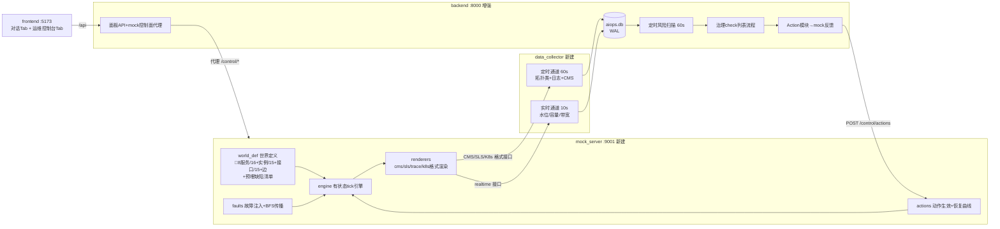
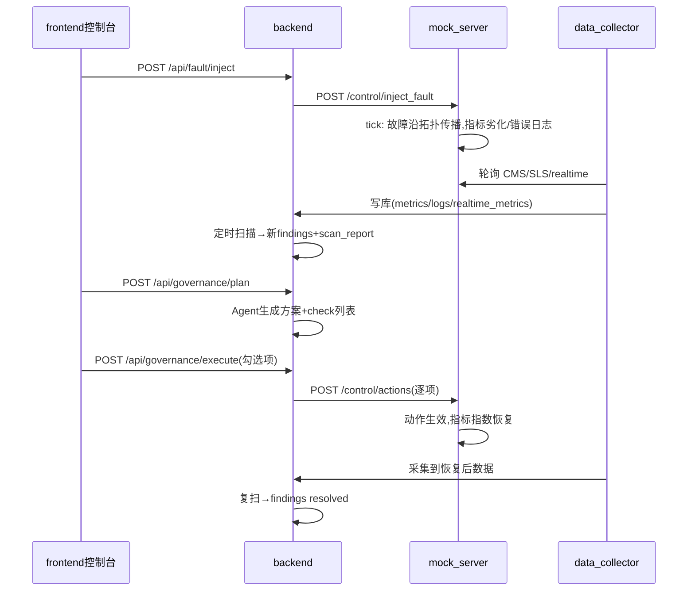

# feat: 动态 Mock 数据闭环与四模块并行执行方案

**计划深度**: Deep ｜ **日期**: 2026-08-04
**方案性质**: 只规划不改码（获批后可存档至 `docs/plans/2026-08-04-001-feat-dynamic-mock-loop-plan.md`）
**版本**: v1.1 —— 按现有代码实测 review 修订（修订记录见文末 §v1.1），修订点均以 🔧 标记

---

## 摘要

将现有"静态文件 Mock → 一次性全量采集 → 对话式 Agent"演进为**动态闭环**：独立 `mock_server/` 持续演算一个可注入故障、可被治理动作影响的微型世界，并按阿里云 CMS/SLS API 格式暴露数据；独立 `data_collector/` 以定时（拓扑类）+ 实时（水位类）双通道轮询采集写库；`backend/` 增加定时风险扫描、治理 check 列表确认流程与 Action→mock 反馈；`frontend/` 新增运维控制台（故障注入、实时水位/容量/带宽图表、治理确认）。四模块由本方案固定的接口契约解耦，🔧 可 3 人并行开发（分工见"并行分工与依赖"节）。

**核心演示闭环**: 注入故障 → 采集发现 → 定时扫描出报告 → Agent 生成治理方案与 check 列表 → 用户确认 → 自动治理 → Action 传回 mock → 世界恢复 → 复扫风险消除。

---

## 现状基线与差距结论（调研共识）

已具备（复用不重写）:
- `backend/app/providers/mock_aliyun.py`: 阿里云 API 形态（CMS Datapoints JSON 字符串、SLS 全字符串值、K8s 快照），文件头即声明"替换本文件即可接真实环境"——这是采集端切换到 HTTP 数据源的天然缝隙
- `backend/app/ingest/pipeline.py`: 各数据类型解析入库函数齐全，但 `run_full_ingest` 是"清空重灌"一次性语义
- `backend/app/db.py`: 12 张表（7 张观测数据 + 5 张 Agent 产出），MySQL 优先/SQLite 降级
- `backend/app/tools/`: 风险扫描/规则入库/拓扑构建/4 个治理动作（`patch_deployment`、`create_pdb`、`create_db_index`、`upgrade_rds_instance`）+ `list_governance_actions` 已注册
- `backend/app/harness/`: ReAct loop + 意图调度 + LLM 离线降级；`main.py` 提供 SSE 对话与 `/api/topology`、`/api/risks`
- `frontend/`: React18+antd5+G6，SSE 流式对话、拓扑图、风险报告卡片；vite 代理 `/api`→8000
- `data/Mock数据说明.md`: 完整的数据格式契约（字段、单位、join 键、格式坑），新世界生成必须遵守同一契约

关键差距（全部为增量新建，不动现有主链路）:
- 世界是静态文件且生成器脚本（`mock/world.py` 等）**不在仓库内**，无实时演算、无故障注入、无 Action 反馈
- 无任何定时/实时采集调度；无"水位/容量/带宽"类实时指标与存储表
- 风险扫描仅手动触发；无治理 check 列表确认流程；治理动作只改 DB 快照、不影响数据源

---

## 关键技术决策（KTD）

| # | 决策 | 选择 | 理由 |
|---|------|------|------|
| KTD-1 | Mock 模块形态 | 独立 FastAPI 服务 `mock_server/`（端口 9001） | 用户拍板；进程边界清晰、与真实云环境等价、多人并行不冲突 |
| KTD-2 | 采集模块形态 | 仓库根目录独立进程 `data_collector/` | 用户拍板；与 backend 分离，仅通过数据库共享状态 |
| KTD-3 | 实时数据流转 | 定频轮询拉取（实时 10s / 定时 60s，可配） | 用户拍板；与阿里云 API 拉取语义一致 |
| KTD-4 | 前端 | 新增"运维控制台"Tab（故障注入+实时图表+治理确认） | 用户拍板；所有面板请求仍走 `/api`（backend 代理 mock 控制面），vite 配置零改动 |
| KTD-5 | 世界引擎模型 | 有状态 tick 模拟器（5s/拍）：基线+噪声+故障效应+动作效应；故障沿调用边反向 BFS 逐跳衰减传播；治理后指数衰减恢复 | 保证指标-日志-链路因果一致，闭环可演示 |
| KTD-6 | 数据格式契约 | 新世界严格沿用 `data/Mock数据说明.md` 的格式与 join 键约定（Datapoints JSON 字符串、SLS 字符串值、`req_id`=`traceID`、Pod 名/IP 跨文件一致、trace 微秒单位） | 现有 pipeline 解析、tools 查询、拓扑构建零适配直接可用 |
| KTD-7 | 双进程共库并发 | 默认共用 `backend/aiops.db`，两端初始化时启用 SQLite WAL + busy_timeout=30s，采集按批次单事务写入；`DATABASE_URL` 配 MySQL 时自动走 MySQL（docker-compose 已有） | 最小改动下解决跨进程并发写 |
| KTD-8 | 采集语义 | 由"清空重灌"改为 **append + 时间窗去重**（记录各数据类型高水位 ts，只拉增量）；K8s 资源例外为全量快照替换；collector 自带保留期清理（🔧 观测数据 7 表默认 **2h**，`realtime_metrics` 默认 24h） | 支持持续运行；保留原 `run_full_ingest` 给静态回归模式；🔧 演示只需"注入前后各半小时"，24h 观测数据会把定时扫描（实测 30min 窗 5.6s）拖过 tick 周期 |
| KTD-9 | 回归保护 | backend 增加 `DATA_SOURCE=static|live`（默认 `static`）：static 模式下现有 demo 流程（静态文件 ingest + 手动扫描）行为完全不变；live 模式启用定时扫描并提示数据来自 collector | 评委演示兜底 |
| KTD-10 | 治理确认流 | 新增 `governance_plans` 表 + 三个 API：Agent(LLM) 生成方案与 check 列表 → 前端勾选确认 → 逐项执行现有治理工具并转发 Action 至 mock；LLM 不可用时降级为规则模板生成 | 满足"check 列表确认后自动治理"，复用现有 remediation 工具 |
| KTD-11 | 定时 vs 实时内容边界 | **定时通道（60s）**: K8s 资源快照、trace spans、ingress/app/slow/k8s-events 日志、CMS 分钟级指标 → 现有 7 张表（拓扑梳理与规则扫描用）。**实时通道（10s）**: `/realtime/metrics` 发生器的水位（CPU/内存/连接%）、容量（副本/最大连接/容量%）、带宽（进出 Mbps/使用%）瞬时值 → 新表 `realtime_metrics`（前端图表与容量类规则用） | 需求明确要求区分两类采集内容 |
| KTD-12 | 前端图表 | 新增依赖 `@ant-design/plots`（G2 系，与现有 antv/G6 同族）；安装失败时降级 antd Progress+Statistic | 折线趋势图表达水位变化 |
| 🔧 KTD-13 | 数据量预算（四参数冻结，U1/U2/U6/U9 共同遵守） | 入口流量 `ENTRY_RPS=5`；trace 采样率 `TRACE_SAMPLE_RATE=0.1`（对齐现有数据集，保持 req_id↔traceID 的方向性语义）；观测数据保留 2h；规则/拓扑扫描窗 `RULE_WINDOW_MINUTES=5` | 实测基线：现有世界 6.6 QPS/30min 即 1.2 万行 ingress、9,246 span，共享 RDS 上 run_risk_scan 5.6s、build_topology 1.4s（全量拉取）；不冻结此四数，每 60s 的定时扫描必被自己拖死 |
| 🔧 KTD-14 | live 模式规则判定改造（见 U9.5） | 数据类规则全部加滑动时间窗 + 按实例（dims）分组判定；live 模式禁用 governance 标记判定 resolved，纯靠窗口数据自然恢复 | 现有规则全表聚合（builtin.py:63 `SELECT AVG(avg) FROM metrics`）：append 模式下故障数据被基线稀释，AVG 类规则永不越阈 → 验证契约 §3 的 new_findings>0 必然失败；且新世界 2×RDS 不分组会把单实例 95% 稀释成双实例均值 67% | 

---

## 系统架构



闭环时序:



---

## 接口与数据契约（四模块共同遵守，逐字为准）

### A. mock_server 对外接口（:9001）

数据平面（阿里云风格，供 collector；格式细节与 `data/Mock数据说明.md` §3 一致）:
1. `GET /cms/ListMetrics` → `[{"Namespace":"acs_k8s","MetricName":"pod.cpu.utilization"}, ...]`
2. `GET /cms/DescribeMetricList?Namespace=&MetricName=&StartTime=&EndTime=`（毫秒）→ `{"Code":"200","RequestId":"...","Namespace":"...","MetricName":"...","Period":"60","Datapoints":"<JSON字符串数组>","NextToken":null}`；Datapoints 元素含 `timestamp`(ms)/维度键/`Average`/`Maximum`/`Minimum`；引擎内存保留最近 60 分钟分钟级数据点
3. `GET /sls/GetLogs?logstore=&from=&to=&offset=0&lines=1000`（from/to 秒）→ `{"count":N,"total":N,"offset":N,"logs":[{...}]}`；logstore 枚举与值风格（全字符串、`__time__`/`__topic__`/`__source__`）同现有 5 类；trace 的 `attribute`/`resource` 仍为 JSON 字符串、时间微秒
4. `GET /k8s/resources` → 与现有 `k8s_resources.json` 同构（nodes/deployments/pods/services/poddisruptionbudgets 五个 List）
5. `GET /realtime/metrics?service=&instance=`（参数可空=全量）→ `{"ts":<ms>,"items":[{"service":"order-service","instance":"order-service-xxx-yyy","kind":"pod|rds|redis|node","water_level":{"cpu_pct":62.1,"mem_pct":71.0,"conn_pct":55.2},"capacity":{"replicas":2,"max_conn":800,"capacity_pct":68.0},"bandwidth":{"in_mbps":34.2,"out_mbps":51.8,"usage_pct":43.0},"status":"normal|degraded|faulty"}]}`

控制平面:
6. `GET /control/scenarios` → `{"scenarios":[{"id":"rds_conn_spike","title":"RDS连接数打满","target":"rds-mysql-order","description":"..."}]}`
7. `POST /control/inject_fault` 入参 `{"scenario_id":"rds_conn_spike"}` → `{"fault_id":"F-20260804-001","status":"active","affected":["rds-mysql-order","order-service","api-gateway"]}`
8. `POST /control/recover_fault` 入参 `{"fault_id":"F-..."}` → `{"fault_id":"F-...","status":"recovering"}`
9. `POST /control/actions` 入参 `{"action_type":"scale_out|restart_pod|create_db_index|upgrade_rds|patch_resources","target":"<服务或实例>","params":{},"source":"backend-agent"}` → `{"accepted":true,"effect":"replicas 2->4, 预计3拍内水位回落","world_version":18}`
10. `GET /control/world_status` → `{"world_version":N,"tick_ts":<ms>,"services":[...],"instances":[...],"edges":[{"source":"...","target":"..."}],"active_faults":[...],"recent_actions":[...]}`

预置故障场景（🔧 首期 **4** 个必做，均定义传播路径与恢复动作映射）: `rds_conn_spike`、`slow_query_storm`、`pod_oom_crash`、`instance_down`；`bandwidth_saturation`、`memory_leak` 传播模型调参成本最高，移入 Deferred（接口保留 scenario 扩展位）。

### B. backend 新增 API（:8000，前端唯一入口）

- `GET /api/realtime?service=&minutes=10` → 读 `realtime_metrics` 表 `{"series":[{"name":"order-service.cpu_pct","points":[[ts,v],...]}, ...]}`
- `GET /api/fault/scenarios`、`POST /api/fault/inject`、`POST /api/fault/recover`、`GET /api/world` → 原样代理 mock_server `/control/*`（httpx，超时 5s，失败返回 `{"error":...}`）
- `GET /api/scan-reports?limit=20` → `[{"id":1,"scan_ts":...,"trigger":"schedule|manual","total_findings":N,"new_findings":N,"resolved":N,"summary_json":{...}}]`
- `POST /api/governance/plan` 入参 `{"finding_ids":[可空,空=全部open]}` → `{"plan_id":1,"solution_md":"...","checklist":[{"item_id":"c1","action_type":"create_db_index","tool":"create_db_index","target":"rds-mysql-order","params":{...},"desc":"为orders表建复合索引","risk":"低","default_checked":true}]}`
- `GET /api/governance/plans` → 方案列表（含状态）
- `POST /api/governance/execute` 入参 `{"plan_id":1,"item_ids":["c1","c3"]}` → `{"results":[{"item_id":"c1","status":"success|failed","message":"..."}],"plan_status":"completed"}`

### C. 数据库新表（backend 与 collector 两端同构定义）

- `realtime_metrics`: id PK / ts BigInteger(ms,index) / service String64(index) / instance String128(index) / kind String16 / metric String64(index)（枚举: cpu_pct, mem_pct, conn_pct, capacity_pct, replicas, max_conn, bandwidth_in_mbps, bandwidth_out_mbps, bandwidth_usage_pct）/ value Float / status String16 / raw_json JSON —— 写入端: collector；读取端: backend
- `scan_reports`: id PK / scan_ts BigInteger(index) / trigger String16 / total_findings Integer / new_findings Integer / resolved Integer / summary_json JSON —— backend 专用
- `governance_plans`: id PK / finding_ids_json JSON / solution_md Text / checklist_json JSON / status String16(draft|confirmed|executing|completed|failed) / created_at BigInteger / executed_at BigInteger / result_json JSON —— backend 专用

### D. 配置项

- backend `.env`: `MOCK_SERVER_URL=http://localhost:9001`、`DATA_SOURCE=static`（默认）、`RISK_SCAN_INTERVAL_S=60`、🔧 `RULE_WINDOW_MINUTES=5`（live 模式规则/拓扑/api_perf_stats 的滑动窗；static 模式不生效，保持全表语义以保旧演示基准）
- data_collector `.env`: `MOCK_SERVER_URL`、`DB_URL`（默认 `sqlite:///../backend/aiops.db`，支持 MySQL URL）、`TOPO_INTERVAL_S=60`、`REALTIME_INTERVAL_S=10`、🔧 `RETENTION_HOURS=2`（观测数据 7 表）、🔧 `REALTIME_RETENTION_HOURS=24`（realtime_metrics）
- mock_server `.env`: `PORT=9001`、`TICK_INTERVAL_S=5`、`WORLD_SEED=42`、🔧 `ENTRY_RPS=5`、🔧 `TRACE_SAMPLE_RATE=0.1`（KTD-13 四参数中属 mock 侧的两项）

---

## 输出结构（新建目录）

```
mock_server/
  requirements.txt            # fastapi, uvicorn, python-dotenv
  app/
    __init__.py  config.py  main.py          # FastAPI 入口+全部路由
    world_def.py                             # 世界定义常量（服务/接口/实例/边/基线/场景）
    engine.py                                # tick 状态机+60min 环形缓冲
    faults.py                                # 故障场景+反向BFS传播+衰减
    actions.py                               # 动作生效规则+指数恢复
    renderers/ cms.py  sls.py  trace.py  k8s.py
  tests/ test_engine.py test_faults.py test_actions.py test_formats.py
data_collector/
  requirements.txt            # httpx, sqlalchemy, pymysql, python-dotenv
  collector/
    __init__.py  config.py  main.py          # asyncio 双通道调度入口
    db.py                                    # 表定义（镜像7张数据表+realtime_metrics）+WAL
    client.py                                # mock_server HTTP 客户端
    scheduled.py  realtime.py  retention.py
  tests/ test_parse_write.py test_watermark.py
```

---

## 实施单元

### 模块一 mock_server（工作流 A，可独立推进）

### U1. 世界定义与拓扑建模
**Goal**: 定义比现有案例更复杂的新世界：🔧 约 **8** 服务（ingress/web-frontend/api-gateway/user/product/order/payment/inventory）+ 存储中间件（**2×RDS**、redis）、**16+ 实例、15+ 接口、15+ 有向调用边**（🔧 砍掉 mobile-bff/auth/search/notification/kafka/es：均不在任何故障场景传播路径上，演示复杂度靠多实例+双 RDS+故障传播撑，不靠节点数），含每服务基线（QPS/P99/错误率/水位基线/容量上限）与实例命名/IP 规则（沿用 `10.244.x.y` 与 Pod 命名风格）。
🔧 **新增交付物：预埋缺陷清单**——沿用旧世界 6 条配置类缺陷模式映射到新服务名（单副本、缺双探针、缺 PDB、缺 CPU request、缺内存 limit、单可用区），与 11 条内置规则逐条对应，作为稳态基线 finding；同时与基线数值一起交付**阈值对照表**（每条规则：稳态值 / 故障值 / 阈值，供 U9.5 校准，与开发者 C 协同设计）。若不预埋：稳态风险报告空白，HA/CAP 规则与 check 列表里半数治理工具（create_pdb/add_probes 等）无用武之地。
**Requirements**: R1 ｜ **Dependencies**: 无 ｜ **Files**: `mock_server/app/world_def.py`、`mock_server/app/config.py`
**Approach**: 纯 Python 常量+自检函数（副本数与实例列表一致性、边引用存在性），模式对齐 `data/Mock数据说明.md` §2 的世界观组织方式。
**Test scenarios**: 自检通过（实例数=Σ副本）；每条边 source/target 均在服务集内；接口均绑定到存在的服务；🔧 预埋缺陷清单与 11 条规则的映射覆盖检查（每条配置类规则至少命中 1 个预埋对象）。

### U2. 有状态 tick 引擎与实时数据发生器
**Goal**: 每 `TICK_INTERVAL_S` 推进世界一拍：按"基线+日内噪声+故障效应+动作效应"演算每实例水位/容量/带宽与每接口 QPS/时延/错误率；维护 60 分钟分钟级 CMS 环形缓冲与最近 30 分钟日志/trace 事件缓冲。
**Requirements**: R1、R2 ｜ **Dependencies**: U1 ｜ **Files**: `mock_server/app/engine.py`、`tests/test_engine.py`
**Approach**: 单例 `WorldEngine`，asyncio 后台任务驱动；同 seed 同时间轴可复现；实时值查询即读当前拍状态（毫秒返回）。
**Test scenarios**: 固定 seed 下连续 3 拍数值可复现；无故障时各指标在基线±噪声带内；环形缓冲不超 60 分钟窗口；`realtime` 查询含水位/容量/带宽三组字段。

### U3. 故障注入、拓扑传播与 Action 生效
**Goal**: 实现 🔧 首期 **4** 个预置故障场景（rds_conn_spike / slow_query_storm / pod_oom_crash / instance_down，见契约 A）：注入后修改目标实例状态并沿**调用边反向 BFS**（被依赖者故障→调用方劣化）逐跳衰减传播（每跳效应×0.6，最多 3 跳）；`apply_action` 按动作类型改世界状态（scale_out→容量↑水位↓、create_db_index→慢查询消失、restart_pod→泄漏清零、upgrade_rds→max_conn↑、patch_resources→配置缺陷修复），生效后受影响指标按指数衰减（半衰期 2 拍）回归基线；对应的错误日志文案/慢 SQL/ERROR span 与指标同源联动。
**Requirements**: R3、R4 ｜ **Dependencies**: U2 ｜ **Files**: `mock_server/app/faults.py`、`mock_server/app/actions.py`、`tests/test_faults.py`、`tests/test_actions.py`
**Test scenarios**: 注入 `rds_conn_spike` 后 rds conn_pct≥90 且 order-service 错误率上升、api-gateway 轻度劣化（3 跳内衰减）；`recover_fault` 与 `apply_action` 后 5 拍内回落至基线 1.1 倍内；无关服务（如 product）指标不受影响；重复注入同一场景幂等或叠加规则明确。

### U4. CMS/SLS/K8s 格式渲染与全部 HTTP 接口
**Goal**: 按契约 A 实现全部 10 个接口；渲染层把引擎状态转为与 `data/Mock数据说明.md` §3 逐字段一致的格式（Datapoints JSON 字符串、SLS 全字符串值、trace 微秒+JSON 字符串属性、`req_id`=`traceID`、Pod 名/IP 跨产物一致）。
**Requirements**: R2、R3、R5 ｜ **Dependencies**: U2、U3（路由骨架可与 U1 并行先行）｜ **Files**: `mock_server/app/main.py`、`mock_server/app/renderers/*.py`、`tests/test_formats.py`
**Test scenarios**: DescribeMetricList 的 Datapoints 必须 `json.loads` 二次解析成功；GetLogs 分页 offset/total 语义与现有 `_iter_logstore` 兼容；trace 的 attribute 为 JSON 字符串且根 span `parentSpanID==""`；抽样 trace 的 `traceID` 能在 ingress 日志中找到同值 `req_id`；k8s 快照五个 List 键齐全。

### 模块二 data_collector（工作流 B，契约先行可与模块一并行）

### U5. 采集器骨架、DB 层与配置
**Goal**: 可运行的 asyncio 进程骨架：加载配置、初始化 DB（同构表定义+`realtime_metrics`；SQLite 时执行 `PRAGMA journal_mode=WAL` 与 busy_timeout）、mock_server HTTP 客户端（重试+指数退避，启动时探活等待）。
**Requirements**: R6、R7 ｜ **Dependencies**: 无（按契约 A/C 开发）｜ **Files**: `data_collector/collector/{main,config,db,client}.py`
**Test scenarios**: mock 不可达时按退避重试不崩溃；WAL 生效（журнal_mode 查询返回 wal）；表首次自动建齐。

### U6. 定时采集通道（拓扑类）
**Goal**: 每 `TOPO_INTERVAL_S` 拉取并写入：K8s 资源（**全量替换**该表）、CMS 分钟指标与 5 类日志/trace（**append+高水位增量**：各类型记录已采集最大 ts，仅拉 `from=高水位` 之后数据，重启后从库内 MAX(ts) 恢复）；解析逻辑对齐 `backend/app/ingest/pipeline.py` 的字段映射；附带保留期清理（删除超过 `RETENTION_HOURS` 的数据行）。
**Requirements**: R6、R8 ｜ **Dependencies**: U5；联调需 U4 ｜ **Files**: `data_collector/collector/scheduled.py`、`data_collector/collector/retention.py`、`tests/test_watermark.py`
**Test scenarios**: 两轮采集无重复行（同 ts+同键不重插）；中途重启不丢不重；K8s 表始终等于最新快照条目数；清理只删过期行。

### U7. 实时采集通道（水位类）
**Goal**: 每 `REALTIME_INTERVAL_S` 调用 `/realtime/metrics` 全量实例，展平为 `realtime_metrics` 行（每实例每指标一行），单事务批量写入。
**Requirements**: R7、R8 ｜ **Dependencies**: U5；联调需 U2/U4 ｜ **Files**: `data_collector/collector/realtime.py`、`tests/test_parse_write.py`
**Test scenarios**: 一次响应展平行数=实例数×指标数；value 数值化正确；连续写入 5 分钟表行数线性增长且查询按 service+metric 可取出时间序列。

### 模块三 backend Agent 增强（工作流 C）

### U8. DB 扩展、配置与数据源开关
**Goal**: `backend/app/db.py` 增加契约 C 三张表；`config.py` 增加契约 D 各项；`requirements.txt` 增加 `httpx>=0.27`；`DATA_SOURCE=static`（默认）时一切现状行为不变，`live` 时 `/api/ingest` 返回提示"live 模式由 collector 持续采集"而不清库。
🔧 **补充（堵住第二条清库路径）**：`agents/base.py:52` 的 DataAgent 工具集含 `ingest_data`（内部 `DELETE FROM` 七张表），live 模式下对话一句"重新采集"就会清掉 collector 数据——live 模式下将该工具从 DataAgent 工具集移除（或替换为只读的数据概况查询工具）。
**Requirements**: R9、R13、R16 ｜ **Dependencies**: 无 ｜ **Files**: `backend/app/db.py`、`backend/app/config.py`、`backend/requirements.txt`、🔧 `backend/app/agents/base.py`
**Test scenarios**: static 模式下现有 `/api/ingest`、风险扫描回归通过；live 模式 ingest 不再清空 collector 写入的数据；🔧 live 模式下对话请求"采集数据"不触发任何 DELETE。

### U9. 定时风险扫描后台任务与扫描报告
**Goal**: FastAPI lifespan 启动 asyncio 定时任务（仅 `DATA_SOURCE=live`）：每 `RISK_SCAN_INTERVAL_S` 调用现有 `run_risk_scan` 等价逻辑，比对上轮 findings 计算 new/resolved，写 `scan_reports`；新增 `GET /api/scan-reports`。
**Requirements**: R9、R10、R12 ｜ **Dependencies**: U8 ｜ **Files**: `backend/app/harness/background.py`（新建）、`backend/app/main.py`
**Test scenarios**: live 模式启动后每周期产生一条 scan_report；注入故障后 new_findings>0；治理后 resolved>0；static 模式不启动任务。

### 🔧 U9.5 规则时窗与实例粒度改造（v1.1 新增，**闭环成立的前提**）
**Goal**: 让数据类规则在 append 模式下能被故障触发、能随恢复自然消除：
1. 数据类规则（CAP-003/004、DB-001/002、API-001）全部加 `ts >= now - RULE_WINDOW_MINUTES` 滑动窗（仅 `DATA_SOURCE=live` 生效，static 保持全表语义以保旧演示基准不变）；
2. `_metric_avg` 类聚合改为按 dims（instanceId/namespace）分组逐实例判定，finding 的 `resource_ref` 携带实例名（新世界 2×RDS 的前提）；
3. live 模式禁用 governance 标记（`_has_governance_prefix`）判定 resolved，纯靠窗口数据回落——否则动作一执行立刻 resolved（指标尚未恢复），且标记永久存在会让同一场景第二次注入被直接判为已治理；
4. `build_topology` / `api_perf_stats` 同步加时间窗（同一开关）；
5. 阈值与 U1 交付的新世界基线**协同校准**（依据 U1 的阈值对照表：稳态不越阈、故障 2 个扫描周期内越阈）。
**Requirements**: R9、R10 ｜ **Dependencies**: U8；阈值校准依赖 U1 基线定稿 ｜ **Files**: `backend/app/rules/builtin.py`、`backend/app/tools/topology_tools.py`、`backend/app/tools/data_tools.py`、`backend/app/config.py` ｜ **预估**: 约 2h（开发者 C）
**Test scenarios**: static 模式下 11 条旧基准回归不变；live 模式稳态连续 5 个扫描周期无基线外新增 finding；注入 `rds_conn_spike` 后 ≤2 扫描周期内 DB-001 命中且 `resource_ref` 指向正确的 RDS 实例（另一台不报）；恢复后 ≤2 周期转 resolved；同一场景二次注入可再次触发。

### U10. 治理方案与 check 列表流程
**Goal**: 实现契约 B 三个 governance API：`plan` 用 LLM（复用 `harness/llm.py`）基于 open findings 生成解决方案 markdown + 结构化 checklist（每项映射到已注册治理工具与参数），LLM 不可用时降级为按 finding 类型的规则模板；`execute` 按勾选项顺序执行 `registry.execute(tool, params)` 并汇总结果、更新方案状态。
**Requirements**: R13 ｜ **Dependencies**: U8 ｜ **Files**: `backend/app/tools/governance_tools.py`（新建）、`backend/app/main.py`
**Test scenarios**: 无 LLM 时降级模板对 DB-002 类 finding 生成 create_db_index 项；execute 只执行勾选项；单项失败不中断后续项且状态为 failed 项可见；方案状态机 draft→executing→completed 正确流转。

### U11. Action 模块 mock 反馈闭环
**Goal**: 新建 mock 控制面客户端（httpx 封装 `/control/actions` 等）；在 `remediation_tools.py` 四个治理工具成功路径末尾追加"转发动作到 mock_server"（工具名→action_type 映射：patch_deployment→scale_out/patch_resources 按参数、create_db_index→create_db_index、upgrade_rds_instance→upgrade_rds、create_pdb→patch_resources），转发失败仅记 warning 不影响工具返回值；`DATA_SOURCE=static` 时跳过转发。
**Requirements**: R14、R15 ｜ **Dependencies**: U8；联调需 U3 ｜ **Files**: `backend/app/providers/mock_control.py`（新建）、`backend/app/tools/remediation_tools.py`
**Test scenarios**: live 模式执行 create_db_index 后 mock 收到对应 action（mock 侧 recent_actions 可见）；mock 宕机时工具仍返回成功且日志有 warning；static 模式零外呼。

### U12. 面板辅助 API（实时查询+mock 控制面代理）
**Goal**: 实现契约 B 其余端点：`/api/realtime`（聚合 `realtime_metrics` 为 series）、`/api/fault/*`、`/api/world`（代理）；代理统一 5s 超时与错误包装。
**Requirements**: R2、R3、R16 ｜ **Dependencies**: U8；联调需 U4 ｜ **Files**: `backend/app/main.py`、`backend/app/providers/mock_control.py`
**Test scenarios**: realtime 返回按 service.metric 分组且 points 升序；mock 不可达时代理返回结构化 error 而非 500 裸异常；minutes 参数过滤窗口正确。

### 模块四 frontend 运维控制台（工作流 D）

### U13. 控制台布局与故障注入面板
**Goal**: `App.tsx` 顶层引入 antd Tabs：「智能对话」（现有全部 UI 原样）与「运维控制台」；控制台内故障注入卡片：场景列表（GET scenarios）、一键注入/恢复、当前活动故障与受影响服务展示（轮询 `/api/world` 5s）。
**Requirements**: R3、R16 ｜ **Dependencies**: U12 契约（可先 mock 数据开发）｜ **Files**: `frontend/src/App.tsx`、`frontend/src/components/ControlPanel/{index.tsx,ControlPanel.module.css}`、`frontend/src/services/api.ts`、`frontend/src/types/index.ts`
**Test scenarios**: 注入后活动故障区出现 fault 且按钮态切换；恢复后消失；后端不可达显示错误提示不白屏；对话 Tab 功能回归无损。

### U14. 实时水位/容量/带宽图表
**Goal**: 控制台图表区：服务选择器 + 三组折线图（水位%、容量%、带宽 Mbps），轮询 `/api/realtime` 每 5s 增量刷新，展示最近 10 分钟；`package.json` 新增 `@ant-design/plots`。
**Requirements**: R2、R7、R16 ｜ **Dependencies**: U13 ｜ **Files**: `frontend/src/components/RealtimeCharts/{index.tsx,RealtimeCharts.module.css}`、`frontend/package.json`
**Test scenarios**: 注入故障后曲线可见异常抬升；切换服务图表数据切换；空数据时显示占位而非报错。
**Execution note**: 若 `@ant-design/plots` 安装受阻，降级为 antd Progress+Statistic 网格，不阻塞联调。

### U15. 治理 check 列表交互
**Goal**: 控制台治理区：展示最新扫描报告摘要（GET scan-reports）→「生成治理方案」按钮（POST plan）→ 渲染 solution_md（react-markdown 复用）与 checklist（antd Checkbox 列表，默认勾选 default_checked）→「确认执行」（POST execute）→ 逐项结果状态展示 → 提示复扫结果变化。
**Requirements**: R13、R16 ｜ **Dependencies**: U13 ｜ **Files**: `frontend/src/components/GovernancePanel/{index.tsx,GovernancePanel.module.css}`
**Test scenarios**: 取消勾选项不执行；执行中按钮禁用防重复提交；失败项红色标注且可重试；执行完成后报告区 resolved 数上升。

### 模块五 集成

### U16. 端到端联调、回归与清理
**Goal**: 四模块联调验收（见验证契约）；补 `README.md` 启动说明（四进程端口与启动顺序：mock_server→collector→backend→frontend）；清理联调期临时脚本/调试日志。
**Requirements**: 全部 ｜ **Dependencies**: U1-U15 ｜ **Files**: `README.md`
**Test expectation**: none —— 集成验收单元，验收标准见验证契约。

---

## 并行分工与依赖（🔧 v1.1 按 3 人团队重排）

```mermaid
flowchart LR
    subgraph 开发者A mock_server（最重一条线，独占）
      U1 --> U2 --> U3 --> U4
    end
    subgraph 开发者B collector+控制链
      U5 --> U6
      U5 --> U7
      U8 --> U11
      U8 --> U12
    end
    subgraph 开发者C backend规则/治理+前端
      U8 --> U9 --> U9_5["🔧 U9.5 规则时窗改造"]
      U8 --> U10
      U13 --> U14
      U13 --> U15
    end
    U1 -. 阈值对照表 .-> U9_5
    U4 -.联调.-> U6 & U7 & U11 & U12
    U12 -.联调.-> U13
    U3 -.联调.-> U11
    ALL[U1..U15] --> U16
```

- 🔧 分工调整为 3 人：**A = mock_server（U1-U4，约 10h，最重独占一人）**；**B = collector + backend 控制链（U5-U7 + U8/U11/U12，约 8h）**；**C = backend 规则与治理 + 前端（U9/U9.5/U10 + U13-U15，约 10h）**；U16 全员（约 3h）。合计 ≈31h，3 人一天零缓冲——因此 v1.1 同步砍了世界规模（12→8 服务）与场景数（6→4），单测只保 `test_formats.py`（格式穿帮=全链路崩）与 `test_watermark.py`（不重不丢），其余场景测试降级为联调手工验证
- 四条工作流自 Day0 起并行：契约（本方案 A-D 节）即接口冻结基线，任何契约变更须三方同步修改本方案；🔧 另增一条硬依赖：**U1 的基线+阈值对照表必须在 Day0 上午定稿**（A、C 两人协同），它同时锁定 U2 的演算参数与 U9.5 的阈值校准
- 建议里程碑: M1 各模块单测通过（A: U1-U4 / B: U5-U7+U11、U12 / C: U9、U9.5、U10、U13-U15 对 mock 数据）→ M2 两两联调（A×B 数据链、A×B 控制链、B×C 面板链）→ M3 全链路 U16

---

## 验证契约（U16 验收标准）

1. **冷启动**: 依序启动 mock_server(9001)/collector/backend(8000)/frontend(5173)，`DATA_SOURCE=live`；2 个定时周期内 `topology_edges` 非空且 `/api/topology` 呈现新世界拓扑（🔧 ≥10 节点：8 服务 + 2×RDS + redis 里至少 10 个出现在 trace 中）
2. **实时链路**: 控制台图表持续更新；`realtime_metrics` 行数随时间增长；实时通道间隔 10s±2s、定时通道 60s±5s
3. **故障闭环**（🔧 依赖 U9.5，未完成前此条不具备验收条件）: 注入 `rds_conn_spike` → ≤30s 图表出现 conn_pct 飙升 → 下一轮 scan_report new_findings>0（🔧 且 finding 的 resource_ref 指向正确 RDS 实例） → 生成治理方案含 upgrade_rds/create_db_index 类勾选项 → 确认执行 → mock `recent_actions` 收到 → ≤1 分钟指标回落 → 再下一轮扫描 resolved>0（🔧 靠窗口数据自然消除，非 governance 标记）
4. **对话链路**: 「智能对话」中问"当前系统有什么风险"能基于 live 数据回答；故障处理五步法可定位到注入的故障根因
5. **静态回归**: `DATA_SOURCE=static` 且不启动 mock/collector 时，现有 demo（/api/ingest→扫描→对话治理）行为与改造前一致
6. **浏览器 E2E**: 以上 1-4 需通过真实浏览器操作验证（非仅 curl）

---

## 风险与缓解

| 风险 | 缓解 |
|------|------|
| SQLite 双进程写冲突（database is locked） | WAL+busy_timeout=30s+批量单事务；压测锁冲突则一键切 docker-compose MySQL（两端 DB_URL 均支持） |
| 两端表定义漂移 | 契约 C 冻结字段；U16 联调加"两端 create_all 后 PRAGMA 对账"检查项 |
| LLM 不可用导致治理方案生成失败 | U10 规则模板降级路径（沿用 harness 现有离线降级模式） |
| realtime 表膨胀 | collector 保留期清理（24h）；实时指标仅存展平数值行 |
| mock 世界演算与格式契约穿帮（join 键不一致） | U4 格式单测强校验 join 键；不追求静态世界的 7 项全量校验，只保证工具链依赖的关键不变量 |
| 新前端依赖安装失败 | U14 降级方案（antd Progress） |
| 现有 demo 回归 | 新目录纯增量；backend 改动全部藏在 `DATA_SOURCE` 开关后，默认 static |
| 启动顺序依赖 | collector/backend 对 mock 探活重试退避，任意顺序最终一致 |
| 🔧 阈值校准失控（稳态误报或故障不报） | U1 阈值对照表 Day0 上午定稿（A、C 协同）；U9.5 验收项含"稳态 5 周期无误报 + 故障 2 周期内必报"双向断言；实在调不平则收窄到只保压轴场景 `rds_conn_spike` 涉及的 DB-001/CAP 两条规则 |
| 🔧 共享 RDS 被开发期数据污染 | 开发/联调期三人一律 SQLite（collector 默认 DB_URL 已是 SQLite；backend 注释掉 .env 的 DB_HOST 即自动降级）；仅演示机连团队 RDS，谁连 RDS 跑 collector 需群里吼一声（同方案 A 旧约定） |

---

## Rejected Alternatives

- **Mock 作为 backend 子应用**（方案A/C 默认）: 用户明确选择独立服务；子应用会造成采集器"自己调自己"、多人并行冲突面大
- **SSE/WebSocket 推送实时数据**: 用户选择轮询；推送偏离阿里云 API 拉取语义，联调复杂度高
- **复用/移植静态世界生成器脚本**: `mock/world.py` 等脚本不在仓库内，且静态批量生成无法支撑故障注入与 Action 反馈的持续演算；仅继承其格式契约与自洽性思想
- **collector 直接 import backend 的 db.py**: 跨目录包引用脆弱（路径 hack）、部署耦合；改为契约同构双定义+联调对账
- **前端直连 mock_server（vite 双代理）**: 面板请求统一走 backend 代理，保持单一 API 面、便于鉴权与错误包装，vite 零改动
- **APScheduler 等调度依赖**: asyncio 原生定时循环足够（三处均为固定间隔任务），少一个依赖

---

## Assumptions 与范围边界

- 假设 1: 演示环境为本机四进程（非容器化部署）；docker-compose 仅按需提供 MySQL
- 假设 2: 新世界不要求复现 `world_manifest.json` 的 7 项字节级自洽校验，只保证工具链消费所需的格式与 join 键不变量
- 假设 3: 治理"自动化"以 check 列表确认为闸门（人在环），无全自动无人值守要求
- 🔧 假设 4（v1.1 重写，原表述低估了改造面）: 现有 11 条内置规则的**判定阀值与缺陷模式**继续适用，但规则实现必须经 U9.5 改造（时间窗 + 按实例分组 + 阈值随新基线校准）后才能在 live 模式下工作——这不是"个别规则改目标匹配"的联调尾差，而是闭环成立的前置条件（证据：全表 AVG 聚合在 append 模式下被基线稀释、双 RDS 不分组被均值稀释，见 KTD-14）
- **Deferred（不在本期）**: 多世界并存切换、采集背压/断点续采的持久化游标表、治理动作审计报表、mock 数据的持久化重放、单元测试 CI 流水线；🔧 v1.1 新增：`bandwidth_saturation`、`memory_leak` 两个故障场景、除 test_formats/test_watermark 外的单测、kafka/es 等装饰性拓扑节点

---

## 🔧 v1.1 修订记录（2026-08-04，依据对现有代码的实测 review）

修订背景：对照 `backend/` 实际代码逐条验证 v1.0 假设，发现 4 个必修问题 + 1 笔工作量缺口。全部修订已内联到正文（🔧 标记），本节为索引：

| # | 问题（实测证据） | 修订落点 | 严重度 |
|---|---|---|---|
| 1 | 规则全表聚合无时间窗（`builtin.py:63` 等）：append 模式下 AVG 类规则被基线稀释永不越阈；且 `_metric_avg` 不按 instanceId 分组，新世界 2×RDS 会把单实例 95% 稀释成均值 67% → 验证契约 §3 必然失败 | 新增 KTD-14、**U9.5**（时窗+分组+阈值校准+禁用 governance 标记）；契约 D 新增 `RULE_WINDOW_MINUTES` | 致命，闭环前提 |
| 2 | 数据量无预算：实测 30min 窗数据在共享 RDS 上 run_risk_scan 5.6s / build_topology 1.4s（均全量拉取），24h 保留期 + 60s 定时扫描必被拖死 | 新增 KTD-13 四参数冻结（RPS=5、采样 10%、观测保留 2h、扫描窗 5min）；KTD-8/契约 D 同步 | 致命，性能前提 |
| 3 | live 模式第二条清库路径：DataAgent 工具集含 `ingest_data`（`agents/base.py:52`，内部 DELETE 七表），v1.0 只挡了 HTTP 端点 | U8 补充：live 模式从工具集移除 | 高 |
| 4 | 新世界稳态 findings 未定义：不预埋配置缺陷则稳态报告空白、半数治理工具无用；随手写则稳态冒计划外 finding | U1 新增交付物：预埋缺陷清单 + 阈值对照表（与 U9.5 协同） | 高 |
| 5 | 工作量：按单元估算 ≈31h，分工按 4 人排但团队 3 人 | 世界规模 12→8 服务、场景 6→4、单测只保 2 个；分工重排为 A/B/C 三人（见分工节） | 中，但决定能否交付 |

未改动的 v1.0 决策：四模块进程边界（KTD-1/2）、轮询语义（KTD-3）、格式契约（KTD-6）、static 回归保护（KTD-9）、治理确认流（KTD-10）均维持原样——这些经实测对照均成立。
